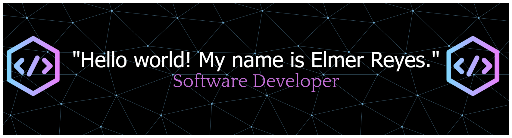

  <blockquote>
    Versatile Junior Professional specializing in Data Analysis, QA, and Software Development. Expert in automating processes and developing scripts to drive efficiency. Technical stack includes SQL, Power BI, Python, and Node.js, with hands-on experience in RESTful APIs and modern web frameworks like Vue. Experienced in delivering high-quality IT solutions and QA testing across diverse freelance and corporate projects.
  </blockquote>

<strong>Talking about Personal Stuffs:</strong>

<table>
  <tr>
    <td>🏦</td>
    <td>I am currently a student of <b>ESIT</b>.</td>
  </tr>
  <tr>
    <td>💻</td>
    <td>Major is <b>Open Source Software Development</b>.</td>
  </tr>
  <tr>
    <td>🌱</td>
    <td>I'm currently learning <b>Web development and English</b>.</td>
  </tr>
  <tr>
    <td>🤔</td>
    <td>My hobbies include <b>Exercise, Reading, and Anime</b>.</td>
  </tr>
  <tr>
    <td>📫</td>
    <td>How to reach me: <b>elmer.reyes.pineda@gmail.com</b>.</td>
  </tr>
  <tr>
    <td>💬</td>
    <td>If you have any questions, <b>just ask me</b>.</td>
  </tr>
</table>

 

🧩 Roles

⚙️ Core Competencies

📊 Data & Analytics

💻 Development Stack

🧰 Tools & Version Control

🏆 Experience

<table>
  <tr>
    <td align="center">
      
    </td>
    <td align="center">
      
    </td>
  </tr>
</table>

